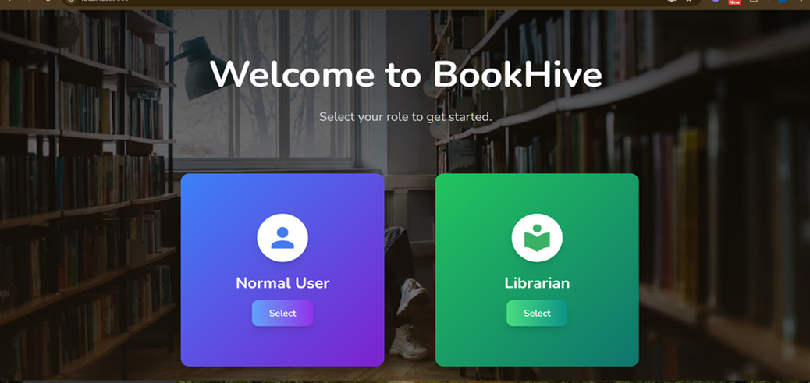
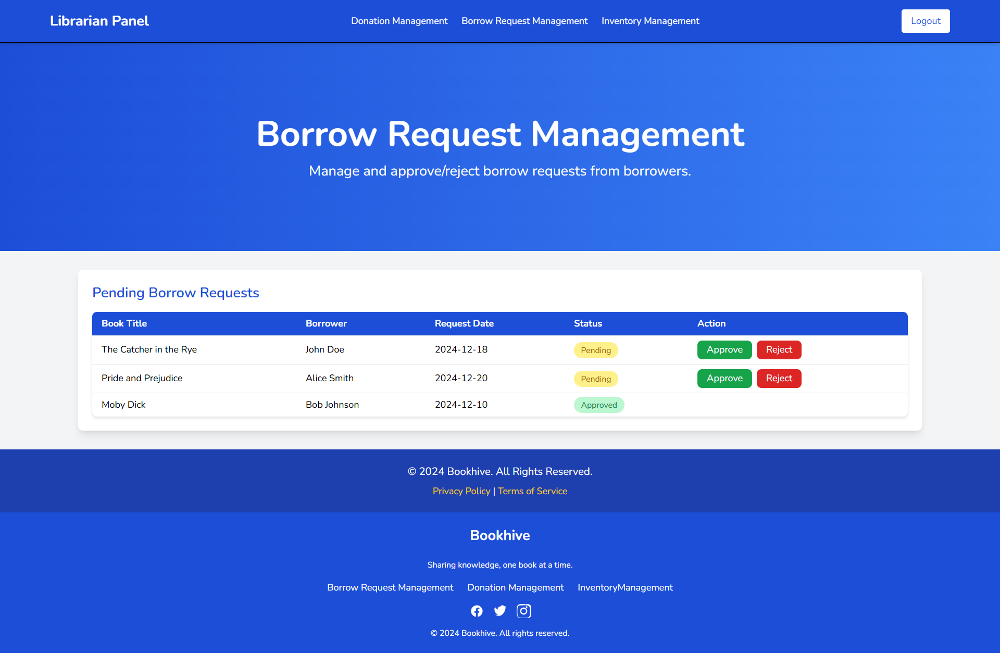

# 📚 Bookhive - A Community-Driven Book Sharing Platform

Bookhive is a **web-based book-sharing platform** based on a idea to promote literacy, encourage book donations, and facilitate book borrowing within a specific geographic area. Our platform enables users to **donate books**, **search for available books**, and **borrow books easily**, while **librarians** manage book allocation efficiently.

---

## 🚀 **Features & Functionalities**

### 📕 **Book Donation**
- Users can donate books by entering **title, author, ISBN, and book condition**.
- Books are categorized for **easy browsing**.
- **Upload book images** for easy identification.

### 📖 **Book Borrowing**
- Search books by **title, author, category, or location**.
- View **real-time availability** .
- Borrowers can **request books directly** using this platform.

### 📦 **Book Allocation**
- Librarians **review and allocate books** to borrowers.


### 🔐 **Authentication & Role-Based Access**
- **User Authentication** via email and password.
- **Role-Based Access**:
  - **Donors & Borrowers**: Can donate, search, and borrow books.
  - **Librarians**: Manage books, approve requests, and track inventory.

### 📊 **Admin Dashboard**
- **Monitor book requests** and track donation progress.
- **Generate reports** on donations, borrowings, and trends.

---

---

## ⚙️ **Installation & Setup Guide**

### 🖥️ **Prerequisites**
Ensure you have the following installed:
- **Node.js** (LTS version recommended)
- **MongoDB** (Local instance or MongoDB Atlas)
- **npm** or **yarn**
- **Git** for version control and as it is public so for adding the contributions.

---

### 🌍 **Backend Setup**
------------------
1. **Navigate to the backend directory**:
   ```sh
   cd backend
   ```
2. **Install dependencies**:

    ```sh
    npm install
    ```
3. **Set up environment variables:**:

- Create a  **.env file**  in the backend directory.
- Add the following environment variables:

    ```sh
    MONGO_URI=your_mongodb_connection_string
    PORT=5000
    JWT_SECRET=your_secret_key
    ```
3. **Start the backend server:**:

    ```sh
    npm start
    ```
4. **API will be available at:**:

    ```sh
    http://localhost:5000
    ```

### 🎨 **Frontend Setup**
------------------

1. **Navigate to the frontend directory**:
   ```sh
   cd front-end
   ```

2. **Install dependencies**:
   ```sh
   npm install
   ```
3. **Start the frontend application**:
   ```sh
   npm start
   ```
4. Open **http://localhost:3000** in a browser.

📖 **Usage Guide**
------------------

1.  **Sign up or log in** to access features.
2.  **Donate books** by filling in the required details.
3.  **Search & borrow books** available in the library.
4.  **Track book delivery** once your request is approved.
5.  **Manage book requests** via the librarian dashboard.

🔑 **API Endpoints (Backend)**
------------------------------

### 📌 **Authentication**

| Method | Endpoint | Description |
| --- | --- | --- |
| POST | `/api/auth/signup` | Register a new user |
| POST | `/api/auth/login` | Login a user |

### 📌 **Book Management**

| Method | Endpoint | Description |
| --- | --- | --- |
| POST | `/api/books/donate` | Donate a book |
| GET | `/api/books/available` | Get available books |
| POST | `/api/books/request` | Request a book |

### 📌 **Librarian Actions**

| Method | Endpoint | Description |
| --- | --- | --- |
| GET | `/api/admin/books` | View pending donations |
| PUT | `/api/admin/allocate` | Allocate book to a borrower |
| DELETE | `/api/admin/remove` | Remove a book |

🤝 **Contributing**
------------------------------

We welcome contributions!

To contribute:
1.  **Fork** the repository.
2.  Create a **feature branch**:

    ```sh
    git checkout -b feature/new-feature
    ```
3. **Commit** your changes:

    ```sh
    git commit -m "Add new feature"
    ```
4. **Push** to GitHub:

    ```sh
    git push origin feature/new-feature
    ```
5. Open a **Pull Request**

🔑 **Screenshot**
------------------------------

1. **Landing Page** :

    

2. **Sign-up Screen** :

    

3. **Login Screen** :

    

4. **User Dashboard** :

    

5. **Book-donation Screen** :

    

6. **Contact-Us Screen** :

    

7. **Terms-of-Service Page** :

    

8. **Librarian Dashboard** :

    

9. **Borrow Request management** :

    


⚠️ **Note**
------------------------------

Please ensure that all reapective dependencies as mentioned above should be present in your local system , so that it can work properly.

Secondly, this is open for contribution and there is room of improvements too , so feel free to contribute and make it better.


